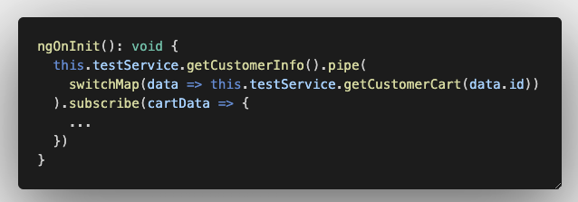
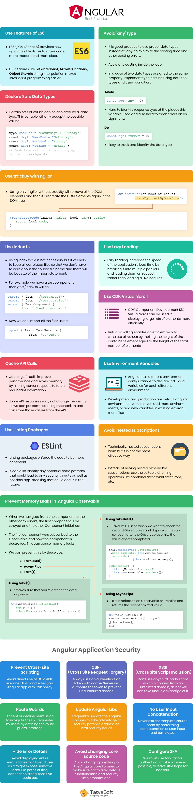

# Best Practices of Angular Development

1. Use Angular CLI
2. Use trackBy along with ngFor

```html
<div *ngFor="let book of books; trackBy:trackByBookCode">{{ book.title }}</div>
```

```javascript
trackByBookCode(index: number, book: any): string {
    return book.code;
}
```

3. Use Lazy Loading (must)

Use CLI to generate lazy loaded module

```
ng g m profile --route profile --module app
```

```javascript
const routes: Routes = [
  {
    path: "profile",
    loadChildren: () =>
      import("./modules/profile/profile.module").then((m) => m.ProfileModule),
  },
];
```

4. Use Index.ts barrel

```javascript
// with barrel index.ts
export { TestInterface } from "./test.model";
export { TestService } from "./test.service";
export { TestComponent } from "./test.component";
export { TestDirective } from "./test.Directive";

// without barrel
import { TestInterface } from "./test.model";
import { TestService } from "./test.service";
import { TestComponent } from "./test.component";
import { TestDirective } from "./test.Directive";

// with barrel index.ts
import {
  TestInterface,
  TestService,
  TestComponent,
  TestDirective,
} from "../test";
```

5. Avoid ‘any’ type
   Avoiding the use of ‘any’ type can potentially lower the number of unexpected issues.

6. Prevent Memory Leaks in Angular Observable

- Manual unsubscribe

```javascript
  myQuerySubscription: Subscription;
  myIntervalSubscription: Subscription;

  ngOnInit() {
     this.myQuerySubscription = this.apiService.getClients().subscribe();
  }

  onStartInterval() {
    this.myIntervalSubscription = interval(250).subscribe(value => {
      console.log('Current value:', value);
    });
  }

   ngOnDestroy() {
    this.myQuerySubscription.unsubscribe();

    if (this.myIntervalSubscription) {
      this.myIntervalSubscription.unsubscribe();
    }
  }
```

- Using takeUntil()

```javascript
import { Subject, interval } from 'rxjs';
import { takeUntil } from 'rxjs/operators';

@Component({ ... })
export class AppComponent implements OnInit, OnDestroy {
  destroy$: Subject<boolean> = new Subject<boolean>();


  ngOnInit() {
     this.myQuerySubscription = this.apiService.getClients()
     .pipe(takeUntil(this.destroy$))
     .subscribe()
  }

  onStartInterval() {
    this.myIntervalSubscription = interval(250)
    .pipe(takeUntil(this.destroy$))
    .subscribe(value => {
      console.log('Current value:', value);
    });
  }

   ngOnDestroy() {
    this.destroy$.next(true);
    this.destroy$.unsubscribe();
  }
}
```

- Using the Async pipe

```html
<li *ngFor="let item of bookService.GetBookList() | async">
  {{item.bookName}}>
</li>
```

- Using take(1)
  It makes sure that you’re getting the data only once.

```javascript
// take(1) prevent multiple accetental subscription, still need unsubscription
this.bookService.GetBookList()
      .pipe(take(1))
      .subscribe(res = {this.bookList = res;})
```

7. Avoid Logic in templates ( no method call from template, use pipe instead )
   Use pipe instead of a function to prevent unnecessary re-rendering

Don't do this.

```html
<h2>{{ makeUpperCase('Angular best practices') }}</h2>
```

```javascript
makeUpperCase(title) {
  return title.toUpperCase();
}
```

8. Cache API calls

Cache API calls for a response that does not change often ( don't use it for search )

9. Declare Safe Data Types

```javascript
type WeekEnd = "Saturday" | "Sunday";

const day1: WeekEnd = "Saturday";
const day2: WeekEnd = "Sunday";
const day3: WeekEnd = "Monday";

// The last line will give this error: Type ‘"Monday"’ is not assignable to type 'WeekEnd'.
```

10. Use CDK Virtual Scroll

When to use ?

- The number of items in the dataset we want to virtualize is known and fixed
- The height of a single row is constant

11. Use Environment Variables

Development and production are default angular environments. We can even add more environments, or add new variables in existing environment files.

12. Use Lint Rules

Angular + ESList + Prettier

13. Maintain Proper Folder Structure
14. Avoid having Subscriptions Inside Subscriptions (nested subscription not acceptable )

- use switchMap instead
- use withLatestFrom
- use CombineLatest

```javascript
// Don't do this
observable1$.pipe(
   first(1)
)
.subscribe(res1 = {
    observable2$.pipe(
        first(1)
    )
    .subscribe(res2 = {
        console.log(`${res1}  ${res2}`);
    });
});
// Soln 1. withLatestFrom use
observable1$.pipe(
    withLatestFrom(observable2$),
    first()
)
.subscribe(([res1, res2]) = {
    console.log(`${res1}, ${res2}`);
});

// Or use 2. combineLatest
combineLatest(observable1$, observable2$).subscribe(
  ([res1, res2]) = {
    console.log(`${res1}  ${res2}`);
  }
);
```

// Or 3. use switchmap



15. Break large components into small reusable components.
    We can also view it as a Single responsibility development principle. Debugging, managing, and testing large components is difficult.

16. Use State Management (NgRx)

Some of the advantages of utilizing state management.

- It allows data to be shared between multiple components.
- It allows for centralized state transition control.
- The code will be cleaner and easier to read.
- It’s simple to troubleshoot when something goes wrong.
- There are development tools that are available for tracing and debugging in state management libraries.

17. Documentation in Code

Even better use documentation tool like compdoc

```javascript
/**
 * This is the get function
 * @param age This is the age parameter
 * @returns returns a string version of age
 */
function getAge(age: number): string {
  return age.toString();
}
```

14. File Naming

```javascript
home.component.ts;

// for multi word - use a dash (-) to separate the words
book - appointment.component.ts;
```

15. Class Names

use a dash (-) to separate the words

```
my-theme
user-profile
```

16. Single Responsibility Principle

Simply use CLI generator else follow its style.

17. Using Interfaces

use interfaces when creating a contract for our class

```javascript
ng g interface userInterface
user-interface.ts
```

18. Using Immutability

https://ultimatecourses.com/blog/all-about-immutable-arrays-and-objects-in-javascript

```javascript
// let's add age to student
const student = {
    id: 1,
    name: "John Doe";
    email: "john@google.com";
}

// Don't do
student.age = 30;

// Use immutable pattern, same applies to Array
const results = {
    ...student,
    age : 30
}

// remove key email from object
// Don't do
delete student.email;

// Do this
const { email, ...student } = state;


// Ex2 - array
// lets add Akram
const users = ['Hemant', 'Sunil', 'Sujith'];

// Don't do

users.unshift('Akram');
const lastUser = users.pop();
const firstUser = users.shift();
users.splice(index, 1, 'Akram');  // ['Hemant', 'Akram', 'Sunil', 'Sujith']

// Do this
// push, unshift
users.push('Akram');
const mappedUsers = [...users, 'Akram'];
const mappedUsers =['Akram', ...users];

// pop
const lastUser = users[users.length - 1];
const mappedUsers = users.slice(0, users.length - 1);

// shift
const firstUser = users[0];
const mappedUsers = users.slice(1);

// add/remove in between
const mappedUsers = [...users.slice(0, 1), 'Akram', ...users.slice(1)]  // ['Hemant', 'Akram', 'Sunil', 'Sujith']

```

19. Change Detection Optimisations

- If Small DOM elements aren’t visible, instead of concealing them using CSS, it’s a good idea to remove them from the DOM using \*ngIf.
- If want to toggle large DOM tree use [hidden]="!isValid" instead of using \*ngIf="isValid" as removing/adding large dom tree is very constly.
- Complicated calculations should be cached for as long as feasible - memoization
- To inform Angular that no modifications have occurred, use the OnPush change detection technique. This allows you to skip the whole change detection process.

20. Use Smart – Dumb Components Technique

Smart Component - API calls, controlling states
Dumb Component - input/output

21. use of reactive programming with RxJS

Keep the data in stream, and use whenever needed, try to avoid subscribe

22. Try Avoiding the Use of Logic in the Component, logic should go to services

## General Coding Best Practices

- Files should be limited to 400 lines of code.
- Create short functions with no more than 75 lines of code.
- All symbols should have the same name.
- The pattern feature.type.ts is preferred.
- Declare it with ‘const’ if the variables’ values aren’t changing.
- Separate terms in the descriptive name with dashes, and separate the descriptive name from the type with dots.
- Property and method names should always be written in camelCase (Ex. iterationCount).
- use of reactive programming with RxJS



## Resources

https://angular.io/guide/styleguide

https://www.tatvasoft.com/blog/angular-optimization-and-best-practices/
