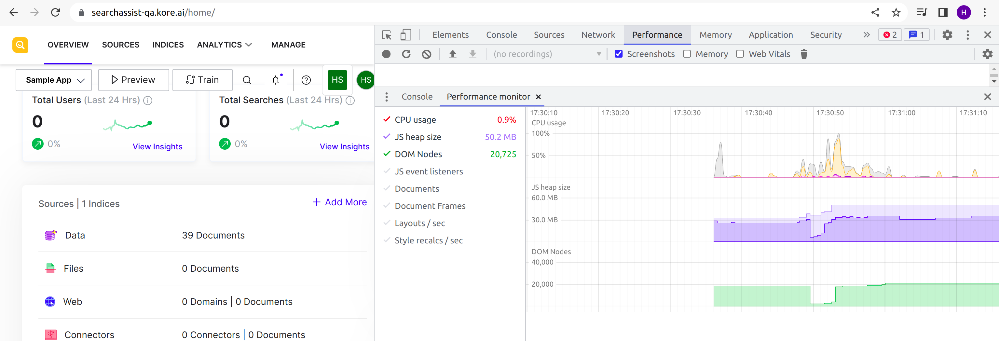

## Why is this upgrade necessary ?

- Reliable build, as with newer version of angular we able to catch UI error in dev itself
- Better performance, Better dv/qa/end user experiance, no one love to browse slow app
- Security Updates

- Introduction of new features
- Constant Evolution of the Framework (write a better and efficient code)
- Better Tooling Support

# Build

## Now


## Prev


Bundle size reduction

```
main        17.6MB / 9.06MB     = 8.54MB
polyfill    1.65MB / 1.16MB     = 0.49MB
runtime     6.15KB / 1.80KB     = 4.35KB
styles      1.66MB / 1.12MB     = 0.54MB
scripts     646KB  / 375.66KB   = 271KB
```

## Performance

## Now


## Before


Gain...


21.6MB loaded in 1.72sec in dev environment ( Un optimized dev build)
8.4MB loaded in 4.62sec in qa env ( better server, better caching , optimized build )

isn't its magic!

# Performance Monitor Report

## Now


## Before


