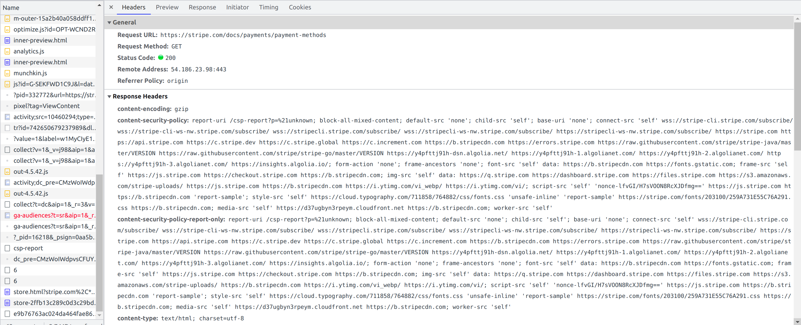

# Angular Security Best Practices

Web Security is very important nowadays to protect a site/app from security attacks and data theft.

1. Cross-Site Scripting

Attacker add script and execute it on your page, but why ??

- They can challenge you by removing your web page
  completely, continuously
- They can steel your cookies and session

## Prevent client-side XSS attacks

- Avoid any modification in the whole DOM tree, How ?

```javascript
// component
htmlSnippet =
  'Hello, <script>alert("Hi Tatvasoft")</script> <i>Good morning</i>';
```

```html
<div [innerHTML]="htmlSnippet">{{htmlSnippet}}</div>

// Angular escape script, it will render only safe html 'Hello,
<i>Good morning</i>'
```

In case you want to prevent angular automatic sanitiation use DOMSanitizer API...

DOMSanitizer APIs can be used to avoid automatic sanitization

```javascript
constructor(private sanitizer: DomSanitizer) {
    this.trustedHtmlSnippet = this.sanitizer.bypassSecurityTrustUrl(
        this.htmlSnippet
    );
}

// bypassSecurityTrustHtml
// bypassSecurityTrustResourceUrl
// bypassSecurityTrustScript
// bypassSecurityTrustStyle
// bypassSecurityTrustUrl
```

```html
<a [href]="trustedHtmlSnippet">Execute JS</a>
```

- You must avoid direct use of DOM APIs as Angular recommends usage of templates, use renderer

```javascript
 constructor(
    private elementRef: ElementRef,
    private renderer: Renderer2
  ) {
    /*this.elementRef.nativeElement.style.color = 'blue'; // Avoid this.*/
    this.renderer.setStyle(this.elementRef.nativeElement, 'color', 'blue');
  }
```

2. Content security policy (CSP)

In order to prevent XSS attacks, we need to set policy for content security

```html
<meta
  http-equiv="Content-Security-Policy"
  content="default-src 'self'; img-src https://*; child-src 'none';"
/>
```

better use CSP as response header



https://csper.io/docs/content-security-policy

2. HTTP-related Vulnerabilities

1. CSRF (Cross-site request forgery)
1. XSSI (Cross-site Script Inclusion)

## CSRF (Cross-site request forgery)

attacker tries to access data , how?

they intercept user request get info and will access data on your behalf

To avoid use token based authentication

## XSSI (Cross-site Script Inclusion)

somehow (maybe through url) attacker tries to make call to backend and execute api with custom script

To avoid - use Angular HttpClient module, you are covered.

3. Use Route Guards on the Navigation

client side safe guard, only authenticated/authorized user can access specif screens

Use any of these...

- CanActivate: Checks whether the component can be accessed or not
- CanActivateChild: Checks whether the child component can be accessed or not
- CanDeactivate: It asks for permission to discard the changes
- CanLoad: Checks before load feature module ( for lazy loaded modules)
- Resolve: It pre-fetch the route data to make sure that data related navigation is available or not.

## Route Guard Sample

```javascript
// define route guard
import { Injectable } from '@angular/core';
import { Router, CanActivate, ActivatedRouteSnapshot, RouterStateSnapshot } from '@angular/router';

export class RouteGuard implements CanActivate {

 constructor(private router: Router) { }

 canActivate(route: ActivatedRouteSnapshot, state: RouterStateSnapshot) {
 // If token is exist, user may login
 if (localStorage.getItem('token')) {
  return true;
 }

 // otherwise redirect to login page
 this.router.navigate(['/login'], { queryParams: { returnUrl: state.url } });
  return false;
 }
}

// use route guard

import { BrowserModule } from '@angular/platform-browser';
import { NgModule } from '@angular/core';
import { RouteGuard } from './Services/routeGuard'
....
@NgModule({
 declarations: [
 ....
 ],
 imports: [
 RouterModule.forRoot([
 { path: '', component: HomeComponent, pathMatch: 'full', canActivate: [RouteGuard] },
 { path: 'my-profile', component: MyProfileComponent, canActivate: [RouteGuard] },
 ....
 ]),
 ....
 ],
 ....
})
export class AppModule { }

// use with lazy loaded module
export const routes: Routes = [
  {
    path: 'dashboard',
    canLoad: [AuthGuard],
    loadChildren: () =>
      import('./modules/dashboard/dashboard.module').then(
        m => m.DashboardModule,
      ),
  },
];
```

**Note**

Window session storage is more secure than local storage as it is removing user data when the browser gets close and it will prevent any third-party users (hackers) from accessing user’s data.

4. Keep Updating Angular Libraries

keep updating your libraries and take maximum advantage of the angular framework security to keep your systems flexible and secure.

Don't forget attacker will learn and understand your security over the time, so if you not updating you security( Angular technically) you are compromizing security.
