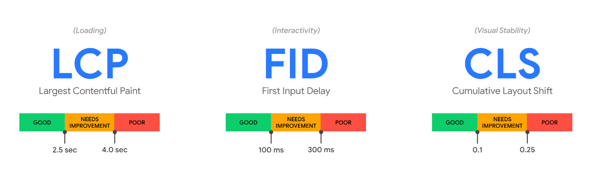

# Web Vitals

Core Web Vitals: LCP / FIS / CLS ( We want this -> 2.5s / 100ms / .1 )

Core Web Vitals are a set of standardized metrics that help developers understand how users experience a web page

## LCP (Page loading performance: 1st useful block render time )
	within 2.5 ( best )
	2.5 - 4s ( Need improvement )
	> 4s ( Slow )

## FIS (Ease of interaction)
	within 100ms ( Good )
	100ms - 300ms ( Need Improvement )
	> 300ms (Poor)

## CLS (Visual stability of a page from a user’s perspective - Layout shift)
	0.1 or less ( Good )
	.1-.25 ( Need Improvement)
	> .25 ( Poor )

## FCP ( how long it takes for a user’s browser to render DOM elements (images, non-white canvas elements, and SVGs).)
	0–2 seconds: Green (fast)
	2–4 seconds: Orange (moderate)
	4+ seconds: Red (slow)
	 
## Speed Index ( shows you the average time that content on your site takes to display to a user. )
	0–4.3 seconds: Green (fast)
	4.4–5.8 seconds: Orange (moderate)
	5.8+ seconds: Red (slow)

## Time to Interactive (amount of time it takes for the content on a page to become functional)
	0–3.8 seconds: Green (fast)
	3.9–7.3 seconds: Orange (moderate)
	7.3+ seconds: Red (slow)

## Total Blocking Time ( how long a web page responds to specific user input.)
	0–300 ms: Green (fast)
	300–600 ms: Orange (moderate)
	600+ ms: Red (slow)

## Performance Scores
	90 (good)
	50–90 (needs improvement)
	below 50 (poor).