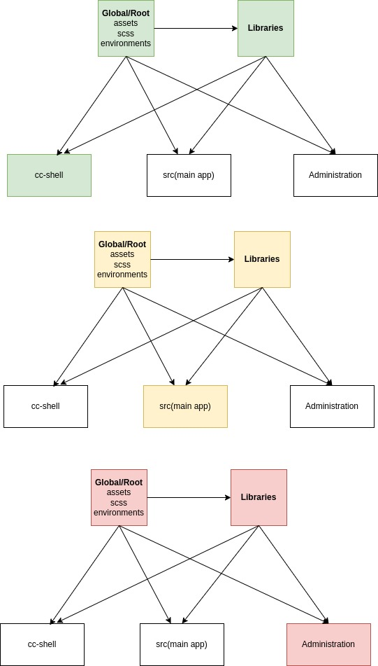

## Why Angular ?

1. Comprehensive framework: Angular is a complete framework that provides everything you need to build large-scale applications, including a powerful templating engine, data binding, routing, form handling, and built-in testing support. React, on the other hand, is a JavaScript library focused primarily on building user interfaces, and you would need to choose additional libraries or frameworks to handle other aspects of your application.

2. TypeScript support: Angular is built with TypeScript, a statically typed superset of JavaScript. TypeScript offers benefits such as improved tooling, better code organization, and enhanced error checking, which can lead to increased developer productivity and more robust applications. While React supports TypeScript, it is not a fundamental part of the framework.

3. Enhanced productivity: Angular provides a set of powerful features that promote productivity, such as a highly declarative template syntax, dependency injection, reusable components, and a well-defined project structure. These features make it easier to develop, test, and maintain complex applications, especially when working with larger teams.

4. Opinionated architecture: Angular follows a specific architectural pattern called the Component-Based Architecture (CBA). This approach encourages modular development, reusability, and separation of concerns, resulting in cleaner code and better maintainability. React, being a library, does not enforce any particular architecture, and the responsibility of choosing an architecture falls on the developers.

5. Official support and documentation: Angular is developed and maintained by Google, which means it benefits from strong backing and ongoing support. It has a large community of developers, extensive documentation, and regular updates, ensuring that you can find help, resources, and solutions to problems easily. React also has a vibrant community, but the official support for Angular can provide additional reassurance for enterprise projects.

6. Ready-to-use features: Angular comes with a rich set of built-in features, including powerful forms handling, routing, state management (with NgRx), and internationalization support. While React offers various libraries and community-driven solutions for these features, Angular's out-of-the-box support can save time and effort during development.

7. Scalability and performance: Angular's architecture and design choices make it suitable for building large-scale applications. The framework provides features like lazy loading, ahead-of-time (AOT) compilation, and tree shaking, which optimize performance and ensure efficient delivery of your application to users. React can also be performant, but it requires additional configuration and libraries to achieve similar optimization levels.

8. Long-term support and stability: Angular follows a predictable release schedule with long-term support (LTS) versions. This ensures that you can rely on Angular for stable, secure, and supported projects, even for an extended period. React, on the other hand, has a more frequent release cycle and may require more effort to keep up with the latest updates and changes.

Ultimately, the choice between Angular and React depends on various factors, such as project requirements, team expertise, and personal preferences.

## Why not to choose Angular

These are some of the main reasons why you might prefer Angular over React for your project. However, you should also be aware of the drawbacks and challenges of using Angular, such as:

1. Angular has a steep learning curve and requires you to learn many concepts and syntaxes. React is simpler and easier to learn and use.

2. Angular is less popular and has a smaller community than React. This means that you might find less support, resources and third-party libraries for Angular than for React.

3. Angular is more verbose and requires more code than React. React is more concise and expressive with features like JSX and hooks.

# 1. Architecture

Throwing 100's of components inside components/ makes your application un-managable, it will not scale for either developers nor it will perform better over the time,

Angular covers you here it gives you more than what you can think.

For better architecture we need to understand following terms...

workspace - collection of projects.
projects - can be library or application
application - independent feature, application should never use another application
libs - common shared code for multiple application
module - A module is simply a way of organizing pieces of functionality together.



## Workspace

A workspace is a collection of projects. Projects can be either libraries or applications.

workspace is not an application, when you create workspace angular cli create an application for you by default

```
// workspace
ng new myworkspace
ng new myworkspace --create-application=false
```

## Application

Independent domain code,big feature

```
ng g application myapp
```

## Library

A library is a collection of components, services, directives etc. that can be shared across different Angular projects.

```
ng g library mylibrary
```

## Difference between Angular Library and Application

a library doesn't have index.html, styles.css, polyfills.ts, main.ts.

In angular.json

```
//mylib
"builder": "@angular-devkit/build-ng-packagr:build",

//myapp
"builder": "@angular-devkit/build-angular:browser",
```

This points to the major difference between a library and an application. While applications build projects for the browser, libraries build projects with ng-packagr, making them reusable across projects.

## package the library

```
ng build my-lib
cd dist/my-lib
npm publish
```

## Module

represent collections of components, services, directives. makes code sharing easy across individual apps.

libs also does same, but library can be packaged and published for easier reuse across projects

2. Angular Material

It is a complete library of reusable UI components. It consists of several components like buttons, form controls, theming options, data tables, etc.

3. Modular Structure

you can separate functionality into reusable pieces of code.

4. TypeScript

Great for making bug free code, so only fined tuned code can go to prod envs

5. Angular CLI

helps in developing, scaffolding, testing, and deploying angular applications.

6. Angular Router

routers navigate from one page to another page without page reload, entry point for adding security to your app

7. Angular Universal

It enables you to render web apps on the server-side. good for ...

1. Improving load time performance
2. search engine optimization
