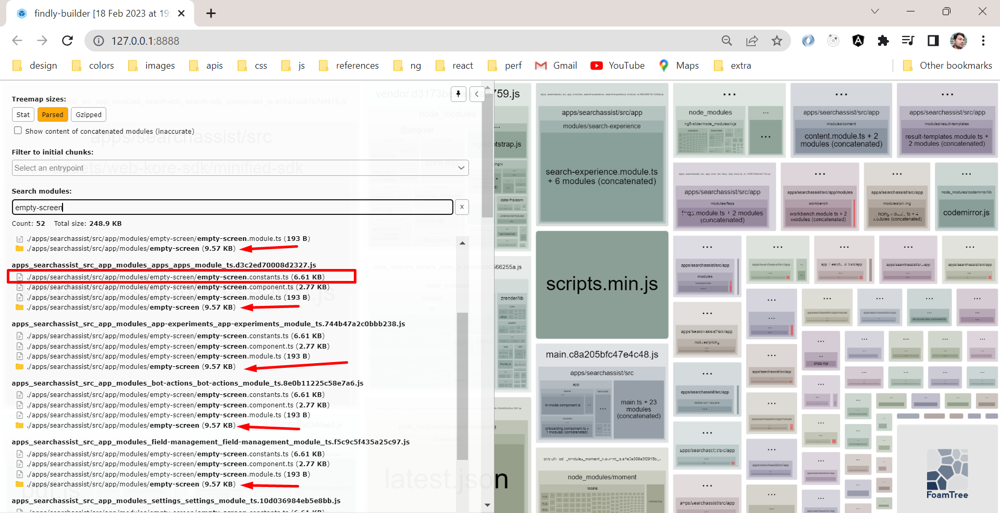

# Lazy load translation files



## How to use lazy translations ?

https://github.com/ngx-translate/core/issues/1193#issuecomment-1435670125

## Resources

https://phrase.com/blog/posts/angular-i18n-ngx-translate/

# Guide

# Setup

```
npm install @ngx-translate/core
npm install @ngx-translate/http-loader
```

## Root Setup

```js
// app.module.ts
export function createTranslateLoader(http: HttpClient) {
  return new TranslateHttpLoader(http, './assets/i18n/', '.json');
}

TranslateModule.forRoot({
  defaultLanguage: 'en',
  loader: {
    provide: TranslateLoader,
    useFactory: createTranslateLoader,
    deps: [HttpClient],
  },
  extend: true,
}),
```

## In lazy module

lets say faqs.module

```js
// Step 1 -configure lazy TranslateModule
// in module
import { TranslateModule } from '@ngx-translate/core';

@NgModule({
  declarations: [FaqsComponent],
  imports: [
    TranslateModule.forChild(),
  ]}
)

// Step 2: load TranslationService
// in component
constructor(
  private translationService: TranslationService
) {
  this.translationService.loadModuleTranslations();
}

// in case you want to use different directory name for lazy i18n do this...
this.translationService.loadModuleTranslations('faqs-new');


// Step 3: create i18n folder
// if no argument used, you need to use same name as route name 'faqs'
apps\searchassist\src\assets\i18n\faqs\en.json

// if using different name then your folder will look like this...
apps\searchassist\src\assets\i18n\faqs-new\en.json
```
