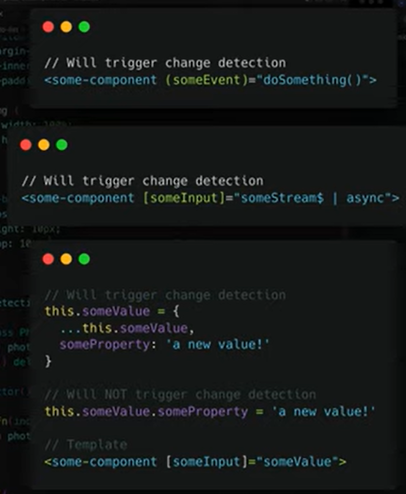

# Change detection

```js
@Component({
  selector: 'app-simulate',
  templateUrl: './simulate.component.html',
  styleUrls: ['./simulate.component.scss'],
  changeDetection: ChangeDetectionStrategy.OnPush,
})
```

With CD `ChangeDetectionStrategy.OnPush` you have no need to worry about ....

1. Event trigger
2. Input Change
3. Object ref change
4. async pipe used


