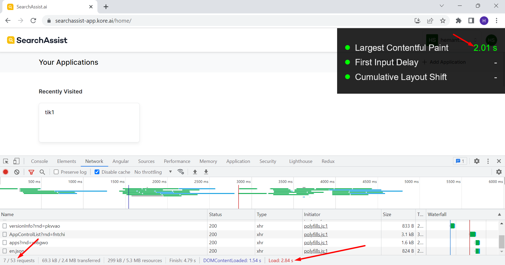
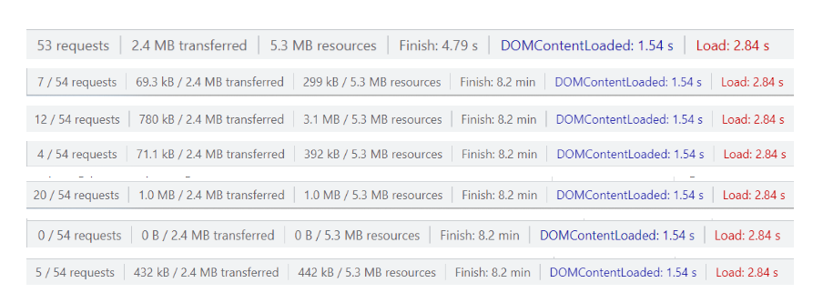
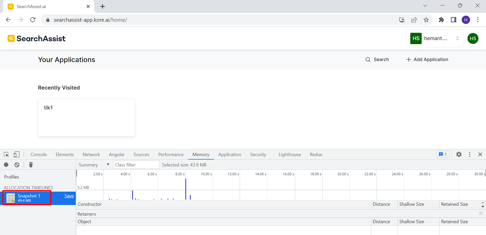
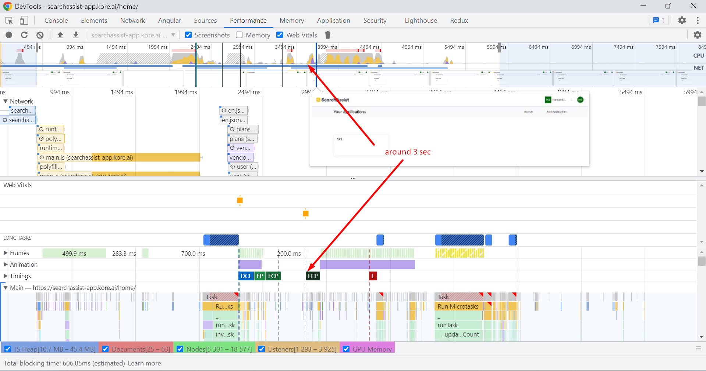
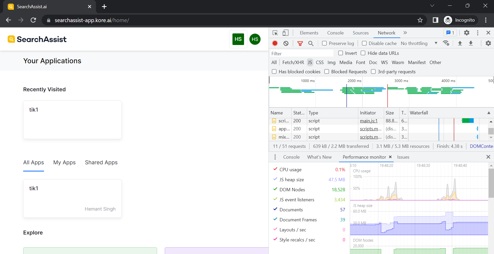
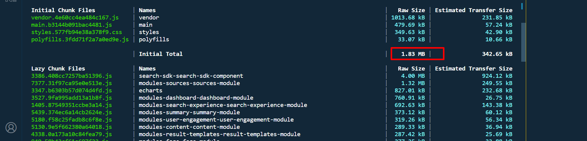
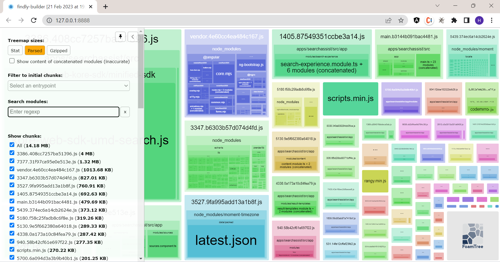
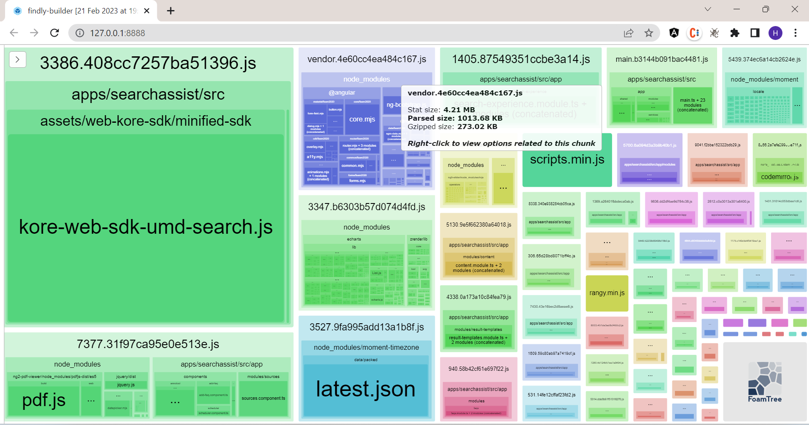
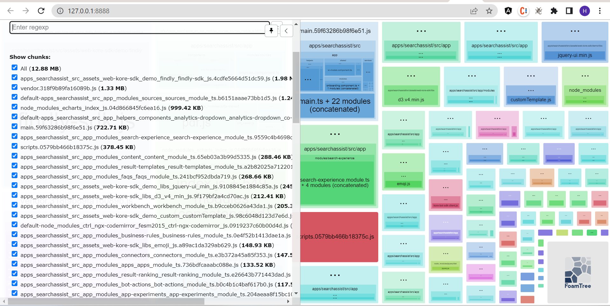
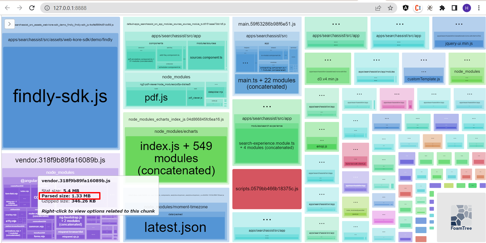

# Performance Report Now

Performance report after angular 15 upgrade and landing page refactoring

Landing page load time, web vitals

Http Requests

Landing page memory consuption

Landing page render performance

Lighthouse Report

[Lighthouse](../images/lighthouse-now.pdf)

Performance monitor report

Bundle size now ( load time )

Webpack bundle analyzer report

Webpack bundle analyzer blocks

OLD

