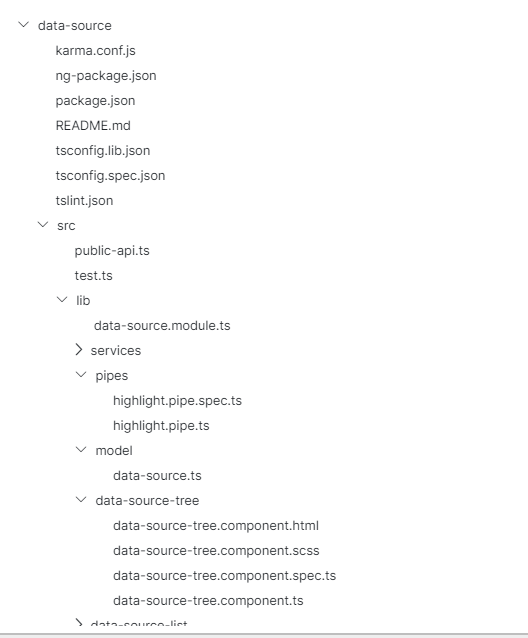

# Upload Folder

Uploading folder and display it as tree

## Uploader HTML

```html
<div class="upload">
  <label for="formFileMultiple" class="form-label visually-hidden"
    >Upload file Dnd</label
  >

  <div class="vstack gap-2 text-center p-4 kr-upload">
    <div>Drag and Drop</div>
    <div>OR</div>
    <div class="kr-browse mx-auto">
      <button class="btn btn-primary">Browse</button>
      <input
        type="file"
        class="form-control"
        id="formFileMultipleDnd"
        (change)="onFolderSelected($event)"
        webkitdirectory
        multiple
      />
    </div>
  </div>
</div>
```

inside `onFolderSelected()` you will get files data that you need to pass to `DataSourceListComponent`

```js
// component
export class UploadFilesTreeComponent {
  TREE_DATA: any = [];
  onFolderSelected(event: any) {
    if (event.target.files.length > 0) {
      const files = event.target.files;
      this.TREE_DATA = files;
    }
  }
}
```

```html
<app-data-source-list [treeData]="TREE_DATA"></app-data-source-list>
```

That's all you will see folder list in UI and its using virtual scroll


